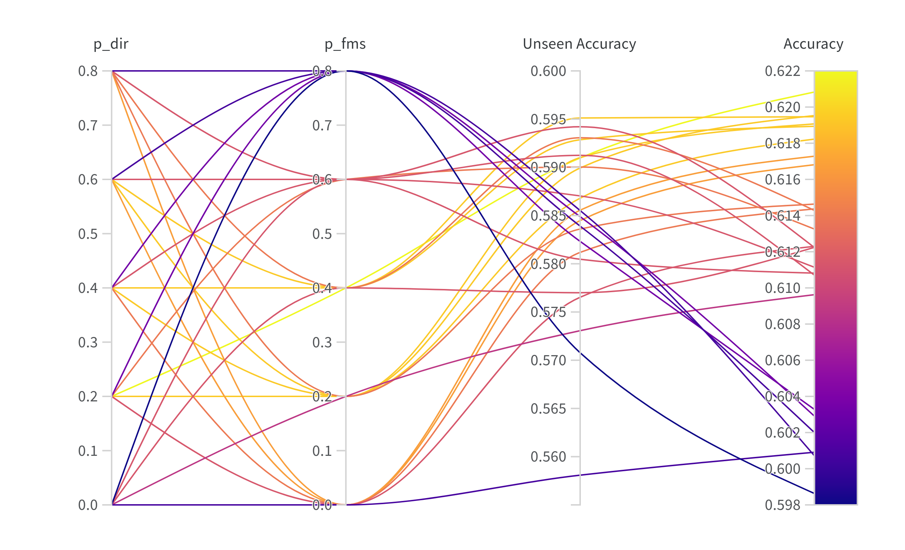

# Device Impulse Response Augmentation

Improving recording device generalization using impulse responses (IRs) of recording devices. \
This code is the official repository for the paper **Device-Robust Acoustic Scene Classification via Impulse Response Augmentation** submitted to [EUSIPCO 2023](https://eusipco2023.org/). 

As described in the paper, this augmentation significantly enhances the generalization performance of models. \
Furthermore, **DIR augmentation** and **Freq-MixStyle** [1, 2] are complementary, achieving a **new state-of-the art performance** on signals 
recorded by devices unseen during training.

The dataset files are optimized for the *TAU Urban Acoustic Scenes 2022 Mobile development dataset* 
which is the dataset used in Task 1 of the [DCASE22](https://dcase.community/challenge2022/) and [DCASE23](https://dcase.community/challenge2023/) challenges.

The DIR augmentation is implemented in the *DIRAugmentDataset* class in the file [*dataset.py*](datasets/dataset.py). 

Code contains **two pipelines** using two different network architectures: 
[**CP-ResNet**](https://github.com/kkoutini/cpjku_dcase20) [3] and [**PaSST**](https://github.com/kkoutini/PaSST) [4].

## Results 


This table presents the performance of the different models and device generalization methods on the *TAU Urban Acoustic Scenes 2020 / 2022 Mobile development dataset (TAU20 / TAU22)* following the official test split. It compares the **baseline**, **MixUp** [5], **Freq-MixStyle (FMS)**, **Device Impulse Response Augmentation (DIR)** and a **combination of DIR and FMS (DIR + FMS)** device-wise. The provided accuracies (%) and device generalization scores (DG) (defined as the standard deviation of the individual device accuracies) are averaged over three runs and the last five epochs of training. The devices are grouped according to **real devices** (Real: A, B, C), the **seen, simulated devices** (Sim: S1, S2, S3) and the **unseen, simulated devices** (Unseen: S4, S5, S6). For each setup, the best-performing method is marked in gray.

### Hyperparameter Sensitivity



This parallel coordinate plot visualizes the relationship between the **Freq-MixStyle probability (p_fms)**, the **DIR augmentation probability (p_dir)**, the **accuracy on unseen devices** and the **overall accuracy**. Each line is an **average over three experiments** of running PaSST on TAU22 using **DIR + FMS** as the device generalization method. As clearly visible, the proposed DIR Augmentation and Freq-MixStyle enhance both the overall performance and the performance on the unseen devices significantly. 

For interactive versions of this plot have a look at my [Weights & Biases report](https://api.wandb.ai/links/tobiasm/74qvxyvh).

## Setup 

Clone this repository and create a new conda environment using the *env.yml* file: 

```
conda env create -f env.yml
conda activate dir
```

Clone this version of PyTorch-Lightning and install it: 

```
git clone https://github.com/theMoro/pytorch-lightning.git
cd pytorch-lightning && python setup.py develop
```

## Run experiments

To train the **CP-ResNet** model run: 

```
CUDA_VISIBLE_DEVICES=0 python -m main_cp_resnet
```

To train the **PaSST** model run: 

```
CUDA_VISIBLE_DEVICES=0 python -m main_passt
```


## References
[1] Florian Schmid, Shahed Masoudian, Khaled Koutini, and Gerhard Widmer, "Knowledge Distillation from Transformers for Low-Complexity Acoustic Scene Classification", in *Proceedings of the 7th Detection and Classification of Acoustic Scenes and Events 2022 Workshop (DCASE2022)*, 2022.

[2] Byeonggeun Kim, Seunghan Yang, Jangho Kim, Hyunsin Park, Juntae Lee and Simyung Chang, "Domain Generalization with Relaxed Instance Frequency-wise Normalization for Multi-device Acoustic Scene Classification", in *Interspeech*, 2022.

[3] Khaled Koutini and Hamid Eghbal-zadeh, and Gerhard Widmer, "CP-JKU SUBMISSIONS TO DCASE’19 : ACOUSTIC SCENE CLASSIFICATION AND AUDIO TAGGING WITH RECEPTIVE-FIELD-REGULARIZED CNNS", Technical Report, 2019.

[4] Khaled Koutini, Jan Schlüter, Hamid Eghbal-zadeh, and Gerhard Widmer, "Efficient Training of Audio Transformers with Patchout", in *Interspeech*, 2022.

[5] Hongyi Zhang, Moustapha Cissé, Yann N. Dauphin, David Lopez-Paz, "mixup: Beyond Empirical Risk Minimization", in *6th International Conference on learning Representations (ICLR)*, 2018
